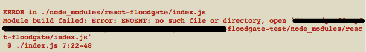

# Testing `react-floodgate`

*This repo is setup to test [`react-floodgate`](https://github.com/geoffdavis92/react-floodgate)'s npm errors*

## The Setup

1. Fork/clone the repo
2. Run `yarn` or `npm i`
3. Run `yarn run webpack` or `npm run webpack` to run webpack.

## The Background

I published Floodgate to the [npm registry](https://npmjs.com/package/react-floodgate) after porting the build from Webpack to Rollup, which is supposed to be easier to use when authoring ES6 modules.

The [Floodgate package.json](https://github.com/geoffdavis92/react-floodgate/blob/master/package.json) lists only `/dist` as the only non-mandatory file(s)/directory to be published on npm, and this is confirmed when installing into a project.

```
# react-floodgate node_module structure
dist
LICENSE
package.json
README.md
```

I have also set the "main", "module", and "jsnext:main" fields to appropriate files in `/dist`, presumably so that when a user installs the package, using `require` or `import` they should be able to access the appropriate file.

## The Problem

When I run `yarn run webpack`, I get the following error:



Apparently Webpack is looking for and `index.js` file, even though in all the places in package.json that Webpack would look to find source files I have no listing of `index.js`, and instead have provided a filename that *is* actually present.

## The Ask

1. Is this a package.json/module error? A Webpack error? A node error?
2. Do I have to include an index.js file in order for users to import my module?
3. What other changes do I have to make to get this module in working order?

---

Thanks!